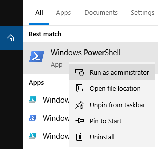
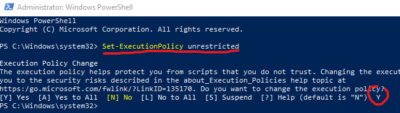
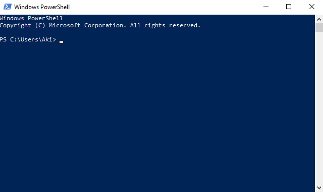

# viiteraportti

Osuuspankin syövereistä voi ladata "tapahtumat" -csv tiedoston vuoden ajalta.

Tällä skriptillä voit laskea aineistoista kaikkien yksilöllisten viitteiden summan, eli mille kaikille uniikeille
viitteille on maksettu euroja. Skripti luo uuden csv -tiedoston nimellä `raportti.csv`.

> Huom! Skripti ei laske viitteettömiä rivejä vaan ohittaa kaikki tyhjät viiterivit.

## Asennus

Avaa powershell admin -oikeuksilla. Etsi windowsin sovelluksista powershell -hakusanalla ja oikealla hiiren painikkeella klikkaa nimen päällä. Valikosta löytyy "Avaa adminina" ( ylin vaihtoehto ):



ja salli skriptien suoritus komennolla:

```powershell
Set-ExecutionPolicy unrestricted
```



Lataa tämän jälkeen [tämä koodiläjä zippinä](https://github.com/AkiHelkio/powerloop/archive/master.zip)

Pura zippi Lataukset kansioon.

Avaa powershell start-valikosta ja siirry kansioon. Alla tuloste esimerkki miltä ikkunan tulisi näyttää:

```
Windows PowerShell
Copyright (C) Microsoft Corporation. All rights reserved.

PS C:\Users\Aki> cd .\Lataukset\powerloop-master\powerloop-master\scripts\viiteraportti\
PS C:\Users\Aki\Lataukset\powerloop-master\powerloop-master\scripts\viiteraportti> ls


    Directory: C:\Users\Aki\Lataukset\powerloop-master\powerloop-master\scripts\viiteraportti


Mode                LastWriteTime         Length Name
----                -------------         ------ ----
-a----        1/25/2020  12:24 AM           2095 luo-tapahtumaraportti.ps1
-a----        1/25/2020  12:24 AM            383 README.md


PS C:\Users\Aki\Lataukset\powerloop-master\powerloop-master\scripts\viiteraportti>
```

Tässä vielä esimerkki havainnekuva. Paina TAB -painiketta niin komentorivi koittaa automaattisesti täydentää polun nimen:




## käyttö

kopioi csv samaan kansioon missä ps1-tiedosto on. Alla suoritus komenot esimerkki csv tiedostolla. Parametrina annetaan tiedoston nimi. skriptin ja csv:n välissä on välilyönti:

```powershell
.\luo-tapahtumaraportti.ps1 tapahtumat20200101-20200125.csv
```

